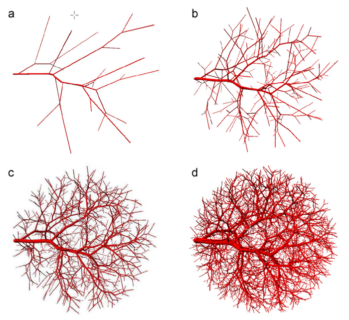

# Vascular Tree 3D Texture Analysis

This repository contains implementations of methods for 3D texture analysis of vascular trees. The project includes:
- Algorithms for vascular tree growth simulation using the Karch method
- Tools for converting vector-based tree models to 3D raster images
- Implementation of 3D texture feature extraction (co-occurrence matrices, run-length matrices, gradient-based features)
- Classification methods for both simulated and real vascular structures
- Example datasets from simulated trees and confocal microscopy images

The goal is to demonstrates how 3D texture features can be used to classify vascular structures and monitor physical parameters such as branch count and blood viscosity, with potential applications in non-invasive medical diagnosis of vascular system diseases.

## 1. Generation of Blood Vessel Trees

In the study, the Karch algorithm was used to simulate the growth of vascular trees. This process is based on physical principles such as the mass conservation principle, Poiseuille's law, and the split law, which describes the relationships between the radii of parent and child branches. The simulation consisted of successively adding output branches of the tree within a given 3D volume. The probability distribution of endpoint location was uniform throughout the volume. Simulation parameters that were varied during the study included: number of terminal branches (3000-5000), input flow, terminal flow, and blood viscosity (1-10 cP). For each tree type, 32 structures were generated with randomly different locations and spatial orientations of branches.
 
<table align="center">
  <tr><td align="center"></td></tr>
  <tr><td align="center"><i>Subsequent phases of vascular tree growth – trees with different number of outlet branches: (a) 20 outlets; (b) 200
outlets; (c) 1000 outlets and (d) 4000 outlets</i></td></tr>
</table>
 
## 2. Converting Vector Description to 3D Raster Image

The generated geometric models of trees (in the form of connected cylinders) were converted into 3D raster images. A simple simulator based on the shape of the MRI scanner point spread function was applied. It was assumed that the image is a collection of cubic voxels, and the signal intensity is proportional to the volume of the voxel part filled with contrast (blood). The partial volume problem was solved by dividing each voxel into 27 or 125 equal sub-voxels. The voxel intensity was the sum of values assigned to its sub-voxels (1 if the center point of the sub-voxel was inside a vessel, 0 otherwise). The final images had a resolution of 256×256×256 voxels.

## 3. Texture Analysis of Blood Vessel Tree Images and Results

Spherical volumes of interest (VOI) were used to calculate texture parameters of the simulated trees. 3D texture features based on co-occurrence matrix, run-length matrix, and gradient were calculated. Key findings:

- 3D texture analysis was significantly more effective than 2D analysis in classifying vascular trees (classification error of 0% for 3D texture vs. 33.6% for 2D texture for Visco type trees)
- Monotonic relationships were found between mean values of 3D texture parameters and physical parameters of vascular trees
- Gradient texture features (e.g., Z_GLevNonU) were mainly related to the number of tree branches, while co-occurrence matrix-based features (e.g., S(0,1,0)SumVarnc) were related to blood viscosity
- Classification remained effective at realistic noise levels (parameter σ from 0 to 5 for Rician noise)
- Unsupervised analysis also confirmed the usefulness of the texture model for quantitative description of vascular images

## 4. Analysis of Confocal Microscopy Images and Results

For experimental confirmation, 3D images of rat brain vascular structure were obtained using confocal microscopy. The effect of NG2 proteoglycan on tumor neovascularization was studied. Four 3D images were analyzed for each of 7 different types of tumor tissue. 3D texture parameters based on the co-occurrence matrix were calculated for VOI covering all voxels of the images, and then transformed into the most discriminating features (MDFs) using Fisher's discriminant analysis.

The results showed that points in the co-occurrence matrix texture feature space and MDF form clearly separated clusters on the scatter plot. The classification error was 31% for co-occurrence matrix features and 0% for MDF features. The study clearly confirmed the possibility of classifying real vascular structures based on numerical parameters of 3D image texture.

## Publications
1. 3D image texture analysis of simulated and real-world vascular trees, M.Kociński, A.Klepaczko, A.Materka, M. Checkenya, A. Lundervold, Computer Methods and Programs in Biomedicne, Vol. 107, nr. 2, ss.140-154, 2012 (IF=1.55) ([link](https://doi.org/10.1016/j.cmpb.2011.06.004))
1. Quantitative analysis of vascular trees represented by digital images; M. Kociński, PhD thesis, Institute of Electronics, The Technical University of Lodz, Lodz, Poland, 2009; (in Polish, [link](https://www.dropbox.com/scl/fi/0nxhbbb67x62jtsokyoe7/2009_Kocinski_Quantitative-analysis-of-vascular-trees-represented-by-digital-images-PhD.pdf?rlkey=8dgvtoqt0ipi7ymh2e4cskmox&st=pe50gubf&dl=0))
1. 2003, Vascular tree growth modeling and fluid flow simulation through porous media, M. Kociński, M. Furmańczyk, A. Przekwas, CFD Research Corporation, 2003. Technical-Report ([link](https://www.dropbox.com/scl/fi/ystwqtmqjjf4jjug2ee0z/2003_Kocinski_Vascular-tree-modeling-Technical-Report.pdf?rlkey=z1s1tgt6nx8fy66bxlc0w3rbe&st=9h3h8b3k&dl=0)) 
